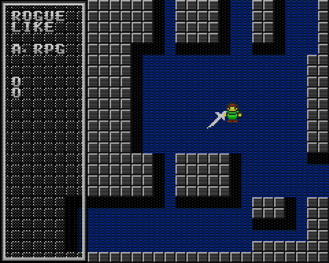

# Rogue Like A.RPG Prototype (仮)



- [VGS-Zero](https://github.com/suzukiplan/vgszero) 用ゲームソフト
- ローグライク ARPG のつもり
- オールマシン語（Z80 アセンブリ言語）で VGS-Zero のゲームを開発したい方向けに知見共有する目的で OSS にしておきます

## How to Execute

Ubuntu Linux の PC または RaspberryPi Zero 2W (実機) で動作します。

### Ubuntu Linux

```bash
# Install toolchain
sudo apt update
sudo apt install build-essential libsdl2-dev libasound2 libasound2-dev snapd
sudo apt install git-lfs
sudo snap install z88dk --beta

# Download repository and build
git clone https://github.com/suzukiplan/rogue
cd rogue
git submodule init
git submodule update
make
```

### RaspberryPi Zero 2W

1. [./image](./image) ディレクトリ以下を micro SD カードへコピー
2. micro SD カードを RaspberryPi Zero 2W へ挿入
3. RaspberryPi Zero 2W へ USB ゲームパッドと電源を接続して起動

## Specification

- 仕様はソース参照
- ソースは [src/main.asm](./src/main.asm) から解析を始めると良いかも


## License

- プログラム（[src](./src)）の部分流用などはご自由にどうぞ
- 本ゲーム（改造したゲームを含む）をそのまま再配布することはご遠慮ください
- 画像や音声などのアセットデータ類の流用はご遠慮ください
- 本プログラムの利用により発生したいかなる問題についても作者は責任を負わないものとします
